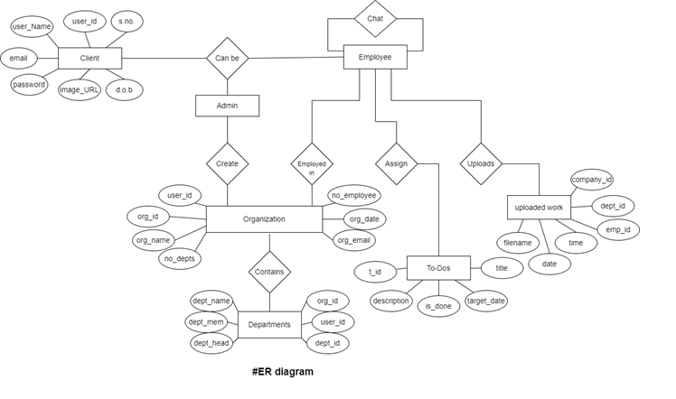
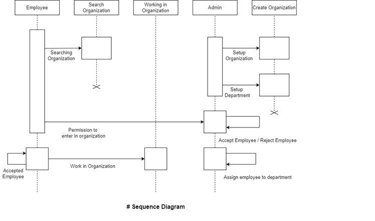
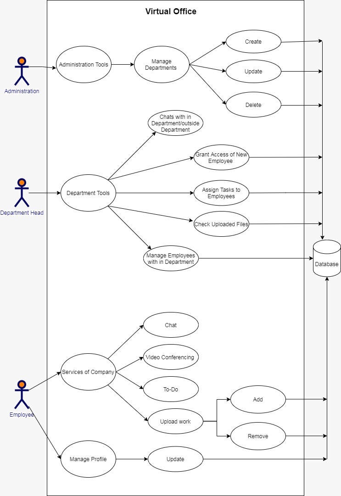
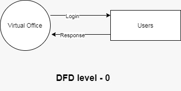
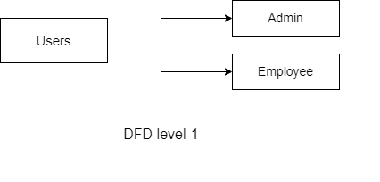
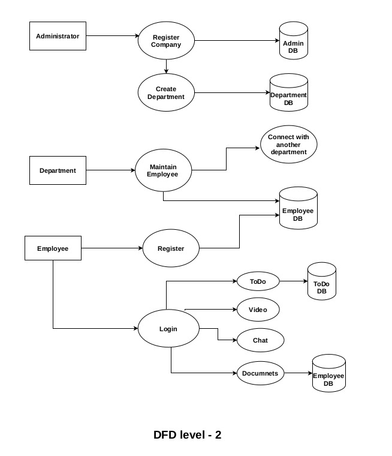
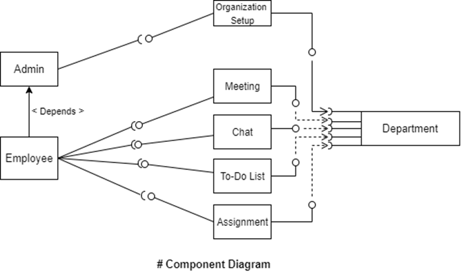
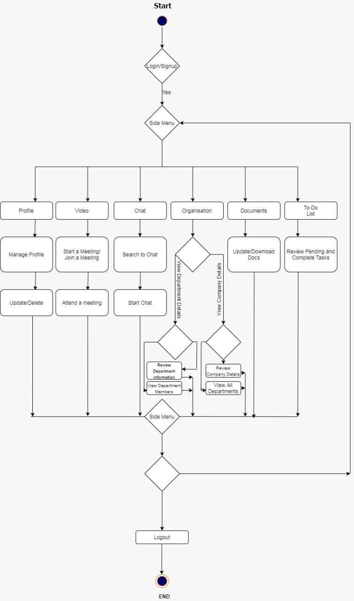

# Virtual-Office
<i>
  <h3>Introduction</h3>
  
 &nbsp &nbsp &nbsp
    Virtual office is a cloud-based unified communications (UC) offering, and it competes with similar products such as Slack, Cisco Webex and Google classroom and MS Team. As a business communications app, Virtual office enables local and remote workers to collaborate on content in real time and near-real time across different devices, including laptops and mobile devices. Virtual office integrates with other business applications, including Exchange, PowerPoint and SharePoint.
      &nbsp &nbsp &nbsp
Virtual office is a persistent chat-based collaboration platform complete with document sharing, online meetings, and many more extremely useful features for business communications. Having an excellent team space is key to being able to make creative decisions and communicate with one another. Shared workspace software makes this much easier to achieve, especially if a particular team is based in a very large company, has many remote employees, or is made up of a significant amount of team members. 
      &nbsp &nbsp &nbsp
Virtual office is usually deployed across entire organizations and not just within certain company departments. In some cases, Teams could replace email for internal company communication among employees. 
 

  <h3> Objective</h3>
  <ul>
    <li>To produce the software which manage the activities done in Virtual Office.</li>
    <li>To maintain the department details.</li>
    <li>To make a communication easily.</li>
    <li>To reduce paper work.</li>
  </ul>
  <h3>Problem Statements</h3>
    <ul>
      <li>The first problem is that today’s generation want everything instantly at just one click of their handsets. Many peoples live far from the offices which makes a bit difficult for them to come to office and attend the meetings and assign its work.</li>
      <li>The second is that generally the offices are situated in the crowded part of the city which simply adds to the difficulty in access during the time of festivals and makes it very difficult to manage meetings on time.</li>
      <li>The third problem is that still some platforms use the traditional user interfaces which make continuous post backs to the server, each post back makes a call to the server, gets the response and then refreshes the entire web form to display the result.</li>
      <li>The fourth problem is that in times of pandemics or crises where people cannot meet physically for work. Employees or people like to work from home for their comfort.</li>
  </ul>
   <h3>Solution Approach</h3>
    <ul>
      <li>The project can provide an easy way to work from where you want instantly as long as you have stable internet connection and hence providing the solution for the first problem which is reducing the travel to reach and present at a office physically.</li>
      <li>One can manage meeting on time or schedule a meeting before-hand on the platform and hence overcoming the second problem of managing meetings as well as attendance.</li>
      <li>Already stated above this project is very helpful during pandemics and crisis as organizations can continue their work effectively without being stagnant hence the platform can be a solution for this problem as well.</li>
      <li>This platform also serve as a solution for a cumbersome task like management as offices can create departments, manage employees, interaction between them as well as work on a project in a synchronization way.</li>
  </ul>
  <h3> Hardware System Specification</h3>
  <ul>
    <li>Intel Pentium 4 or later</li>
    <li>2 Gb RAM</li>
    <li>Operating system (Windows10 / Linux)</li>
  </ul>
  <h3> Software System Specification</h3>
  <ul>
    <li>Netbeans IDE</li>
    <li>Hibernate 5.1 jar</li>
    <li>MySQL Connector jar</li>
    <li>Apache</li>
  </ul>
  <h3>Technologies Used</h3>
  <ul>
    <li>HTML & CSS</li>
    <li>JSP</li>
    <li>JavaScript</li>
    <li>ORM</li>
  </ul>
   <h3>Diagrams</h3>
  <ul>
    <li>ER Diagram</li>
     
    <li>Sequence Diagram</li>
     
    <li>Use Case Diagram</li>
      
    <li>Data Flow Diagram {DFD}</li>
     
     
     
    <li>Component Diagram</li>
     
    <li>Activity Diagram</li>
     
  </ul>
  <h3>Limitations</h3>
  <ul>
    <li>Administration cannot add department in existing organization.</li>
    <li>They cannot chat in a group.</li>
    <li>The user is not able to join organization without logging with proper credentials.</li>
  </ul>
   <h3>Future Enhancement </h3>
  <ul>
    <li>Providing high-end business tolls such graph simulator and generator.</li>
    <li>We can add video chat tool.</li>
    <li>Admin can update details of organization.</li>
    <li>Making messaging more enhanced.</li>
    <li>Easing out the functionalities for better performance.</li>
    <li>Raising security to secure confidential data.</li>
  </ul>
